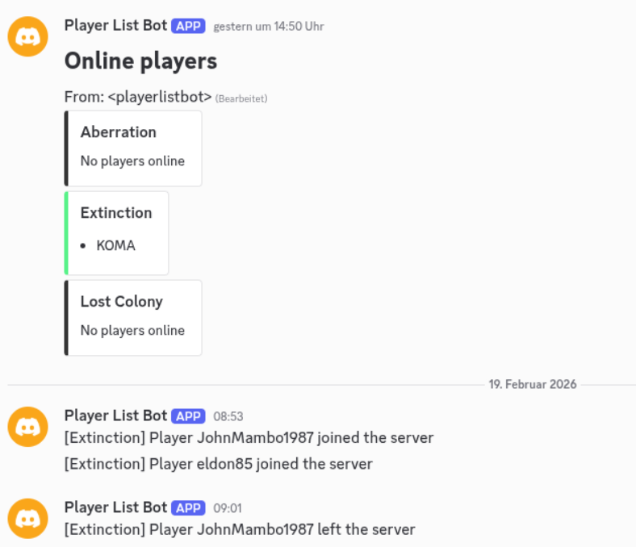
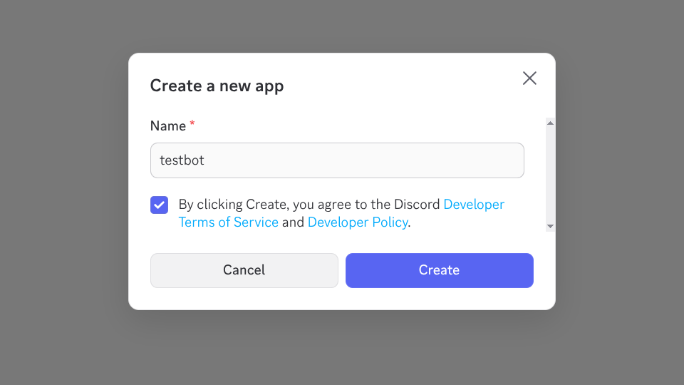
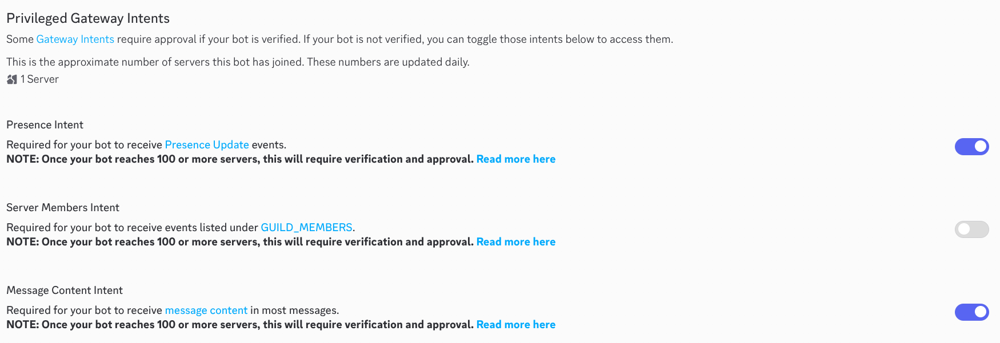
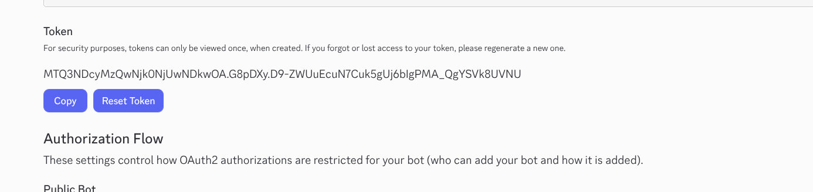
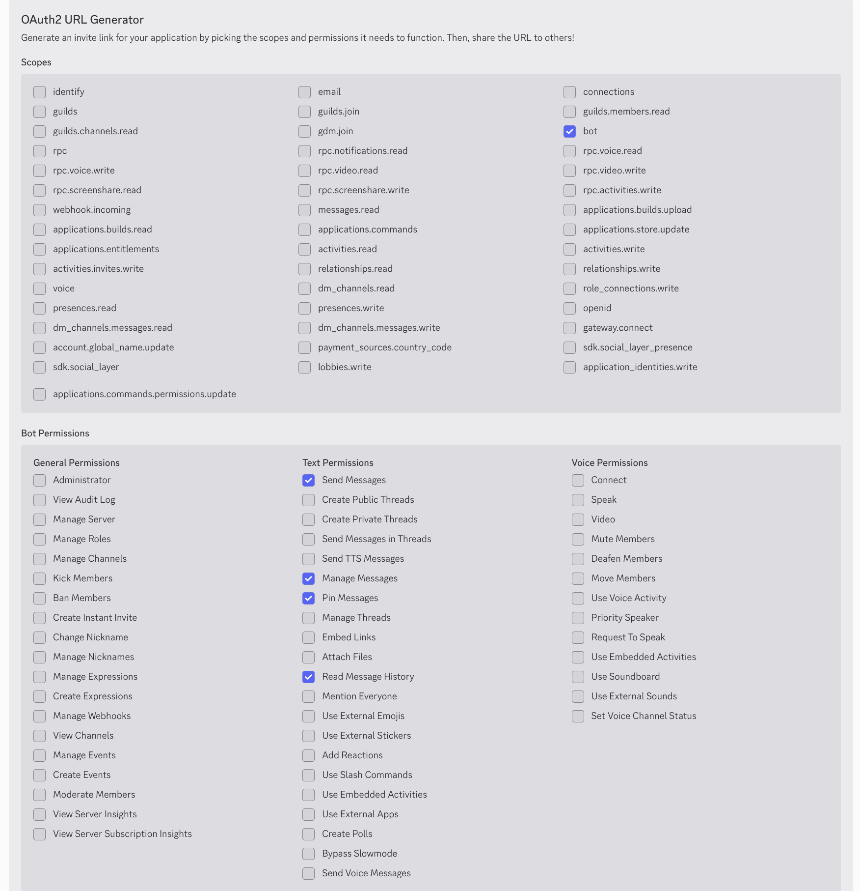
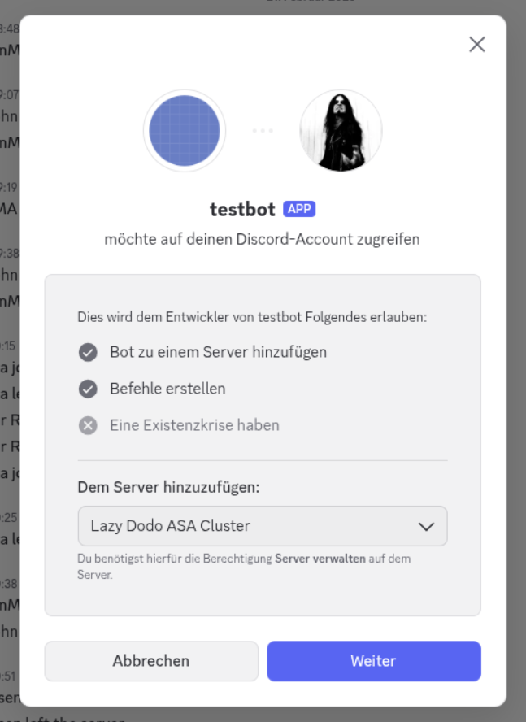
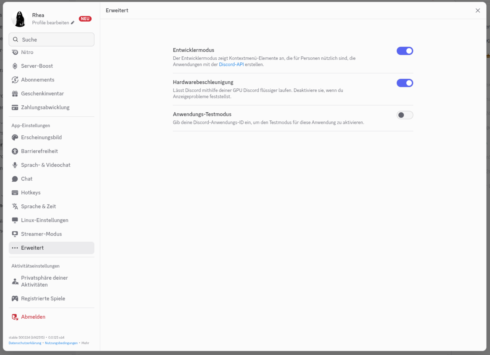
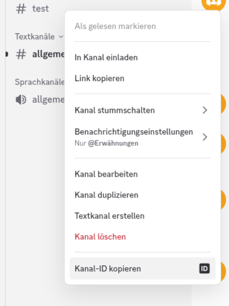

# Overview

This bot connects to one or more gameservers which use valves RCON protocol, to retrieve the list of active players on the server, and posts that list to a discord channel. In addition, the bot can add notifications to a channel whenever a player newly connects to a server, or leaves the server.



## Supported games

This library uses the awesome github.com/gorcon/rcon library to interact with RCON servers. The bot should therefore work with _any_ game which uses the Source RCON protocol.

I have tested it with **Ark: Survival Ascended**, but it should work with other game servers as well.

# Configuration

## Envirnonment variables

The bot can be configured using environment variables. The following variables exist:

| Variable                     | Required | Default  | Note |
|------------------------------|----------|----------|----------|
|DISCORD_BOT_TOKEN             | Yes      |          | The discord bot token |
|DISCORD_CHANNEL_ID_STATUS     | Yes      |          | The discord channel ID for posting the overall player list status |
|DISCORD_CHANNEL_ID_JOINLEAVE  | No       | DISCORD_CHANNEL_ID_STATUS          | The discord channel ID for posting the join/leave notifications |
|DISCORD_MESSAGE_TAG           | No       | playerlistbot | Small identifier to retrieve the message from the channel for editing (otherwise, every update would get a new message) |
|DISCORD_CACHE_PATH            | No       | ./discordplayerlistbot.txt | Cache file to store the message ID of the status message the bot is going to edit upon every player list update. Used to prevent complicated lookup of the message after a bot restart. |
|DISCORD_SHOW_JOINLEAVE        | No       |  true     | Send join/leave notifications to discord every time the bot detecs a player joining or leaving a server |
|DISCORD_PIN_PLAYERLIST        | No       |  true     | The discord bot token |
|RCON_QUERY_EVERY_S            | No       |  30     | The interval (in seconds) at which the bot queries the playerlist at the game server via RCON |
|RCON_SERVERS                  | YES       |          | IP,name,password tuples (separated by ;) for the game servers to connect to |
|LOG_FILE                  | No      |          | File to store logmessages in. Logs to stdout if omitted (default). |

#### Note

`RCON_SERVERS` must be given in the following syntax:

```
RCON_SERVERS="10.0.0.1:27015,Server One,secret123;10.0.0.2:27015,Server two,backup456"
```


## Config file

The bot can also be configured by using a JSON configuration:

```
{
    "rcon": {
        "servers": [
            {
                "address": "xx.xx.xx.xx:27020",
                "name": "Lost Colony",
                "password": "XXXXX"
            },
            {
                "address": "xx.xx.xx.xx:27022",
                "name": "Extinction",
                "password": "XXXXX"
            },
            {
                "address": "xx.xx.xx.xx:27021",
                "name": "Aberration",
                "password": "XXXXX"
            },
            {
                "address": "xx.xx.xx.xx:27023",
                "name": "Scorched Earth",
                "password": "XXXXX"
            }
        ],
        "queryEverySeconds": 60
    },
    "discord": {
        "channelIDStatus": "1111111",
        "channelIDJoinLeave": "11111111",
        "botToken": "XXXXXXX",
        "tag": "playerlistbot",
        "cachePath": "./discordplayerlistbot.txt",
        "showJoinLeave": true,
        "pinPlayerList": true
    },
    "logFile": "./app.log"
}
```

Then run the bot like this:

```
$ ./playerlistbot --config-file config.json
```

# Installation

## Binary

Download a binary from the [Releases](https://github.com/patrickjane/playerlist-bot/releases) for your corresponding architecture, and run the binary. Make sure to set the environment variables as per the above definitions.

Example:

```
$ ./playerlistbot.linux-amd64
2026/02/19 18:37:30 INFO PlayerlistBot 1.0.0
2026/02/19 18:37:30 INFO https://github.com/patrickjane/playerlist-bot
2026/02/19 18:37:30 INFO Monitoring the following servers via RCON:
2026/02/19 18:37:30 INFO    Lost Colony at xx.xx.xx.xx:27020
2026/02/19 18:37:30 INFO    Extinction at xx.xx.xx.xx:27022
2026/02/19 18:37:30 INFO Query servers every 30 seconds
2026/02/19 18:37:30 INFO Connecting to discord
2026/02/19 18:37:30 INFO Creating RCON reader
2026/02/19 18:37:30 INFO Successfully started.

```

## Docker

The bot comes with 2 docker images, linux/amd64 and linux/arm64. Image path is `ghcr.io/patrickjane/playerlist-bot:latest` (or substitute `latest` with an actual version.).

You can run it directly, or e.g. use a `docker compose` file:

`docker-compose.yml`

```
services:
  playerlistbot:
    container_name: playerlist-bot
    image: ghcr.io/patrickjane/playerlist-bot:latest
    restart: unless-stopped
    environment:
      - DISCORD_CHANNEL_ID_STATUS=xxxx
      - DISCORD_BOT_TOKEN=xxxxx
      - DISCORD_CACHE_PATH=/data/cache.txt
      - RCON_QUERY_EVERY_S=60
      - RCON_SERVERS=xx.xx.xx.xx:27020,Lost Colony,MyPassword;xx.xx.xx.xx:27022,Extinction,MyPassword
    volumes:
      - ./:/data
```

And then:

```
$ docker compose up
[+] up 1/1
 ✔ Container playerlist-bot Recreated                                                                                                                                                                    0.1s
Attaching to playerlist-bot
playerlist-bot  | 2026/02/19 17:30:55 INFO PlayerlistBot main
playerlist-bot  | 2026/02/19 17:30:55 INFO https://github.com/patrickjane/playerlist-bot
playerlist-bot  | 2026/02/19 17:30:55 INFO Monitoring the following servers via RCON:
playerlist-bot  | 2026/02/19 17:30:55 INFO    Lost Colony at "xx.xx.xx.xx:27020
playerlist-bot  | 2026/02/19 17:30:55 INFO    Extinction at xx.xx.xx.xx:27022
playerlist-bot  | 2026/02/19 17:30:55 INFO Query servers every 30 seconds
playerlist-bot  | 2026/02/19 17:30:55 INFO Connecting to discord
playerlist-bot  | 2026/02/19 17:30:55 INFO Creating RCON reader
playerlist-bot  | 2026/02/19 17:30:55 INFO Successfully started.
```

#### Note
Use `docker compose up -d` to run the bot in background. Afterwards use `docker ps` to find the container, and `docker logs -f [ID]` to show the logs of the container.

## Windows service

Download the latest archive `playerlistbot-windows-service.zip` from the [Releases](https://github.com/patrickjane/playerlist-bot/releases) and extract it to a location of your choice. For this example, we use `C:\playerlistbot`.

### Step 1

Open PowerShell as Administrator:
- Click Start
- Type: powershell
- Right-click Windows PowerShell
- Click Run as Administrator

Then change to the bot directory:

```
PS C:\Users\Administrator> cd \
PS C:\> cd .\playerlistbot\
PS C:\playerlistbot>
```
### Step 2

Allow script execution (first time only). Run:
```
PS C:\playerlistbot> Set-ExecutionPolicy RemoteSigned -Scope Process
```
In the powershell window (press enter at the end of the line).

### Step 3

Unblock the scripts:

```
PS C:\playerlistbot> Unblock-File .\install-playerlistbot-service.ps1
PS C:\playerlistbot> Unblock-File .\uninstall-playerlistbot-service.ps1
```
(press enter at the end of the lines)

### Step 4

Edit the file `C:\playerlistbot\example-config.json` to your liking, set at least:
- Bot token
- Channel ID for status
- RCON servers

Afterwards, save the file as `config.json` (`example-config.json` is not used by the bot/service).

#### Note
In case you extracted the bot to a different directory, please adjust `logFile` and `discord.cachePath` accordingly. Make sure that you write all backslashes (`\`) as double-backslashs (`\\`).


### Step 5

Install and start the service:

```
PS C:\playerlistbot> .\install-playerlistbot-service.ps1
Creating Windows Service...

Status   Name               DisplayName
------   ----               -----------
Stopped  PlayerListBot      RCON-Discord Playerlist bot
Starting service...

Service installed or updated successfully.
   Installed from: C:\playerlistbot
You can safely re-run this script to apply config changes.
```

You can now see the service in the list of windows services. It should also start with windows automatically.

### Uninstall

In case you want to uninstall the service, just execute the uninstall script:

```
PS C:\playerlistbot> .\uninstall-playerlistbot-service.ps1
Stopping service...
Deleting service...

Service uninstalled successfully.

You may now delete the application folder manually.
```

# Discord bot

This chapter gives a rough overview of how to get a discord bot up and running, in case you have never done it before. This requires a discord developer account, which you can create at https://discord.com/developers .

## Step 1

Go to https://discord.com/developers/applications and create a new application:



## Step 2

On the left side, go to **Bot**. Enable:

- Presence Intent
- Message Content Intent



Save changes.

## Step 3

Scroll up a bit, press the "**Reset Token**" button, confirm with your password, and afterwards copy your token and store it in a secure place. **You can not retrieve it later**, the only way to obtain it again is by resetting again and creating a new token. This token is needed in the bot config.



You might also want to edit the **Username** of the bot, otherwise it will appear as something like **bot1474723406946504908**. You can give it any name you like, e.g. **Playerlist Bot**.

## Step 4

On the left side, go to *OAuth*.Under **OAuth2 URL Generator**, enable "**Bot**", and in the table that appears, check the following permissions:

- Send messages
- Manage Messages
- Read message history
- Pin messages



On the very bottom, there will be a line "**Generated URL**", where you can press the button to copy the URL. Do that.


## Step 5

Paste the URL of step 4 in your browser, where you are logged in to discord. This will open a prompt to invite the bot to your discord server. If you have the discord app installed, it will open the discord app with the same prompt. Confirm to invite the bot to your server.



(Sorry, I only have this in german, but you gonna get it)

## Step 6

In discord, go to **User Settings**, select **Advanced**, and toggle on **Developer Mode**.



(again, I only have this in german, but you gonna get it)

This will allow you to copy channel-IDs, which is needed to tell the bot where to send messages to.

## Step 7

In discord, right-click the channel you want the bot to post messages in, and click "Copy channel ID" on the very bottom.



This will be the channel ID you need for the bot config.

(again, I only have this in german, but you gonna get it)

## Summary

After all the setup, you can use the channel ID (or multiple channel IDs, in case you want the playerlist and the join/leave notifications in different channels) of **Step 7**, and the bot token of **Step 3** to configure your bot.

# License
MIT License, see [LICENSE](LICENSE)